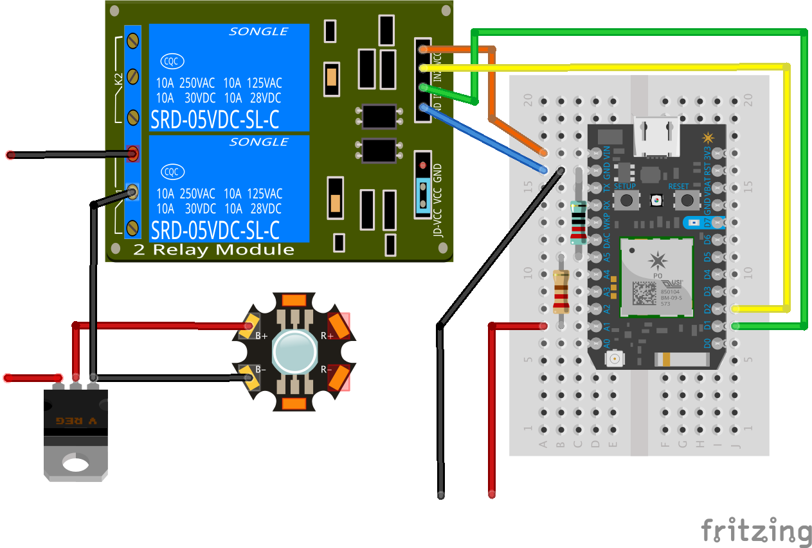

# Alexa Particle

## Overview
An example of integrating control of a [Particle Photon](https://docs.particle.io/datasheets/photon-datasheet/) using voice through an Alexa Skill (Amazon Echo) built with [ASK](https://developer.amazon.com/appsandservices/solutions/alexa/alexa-skills-kit).

The functionality exposed is the ability to read a sensor value (in this case, a voltage reading), return a calculated value (maximum voltage that can be input before frying the
microcontroller), and control an output (this example switches the control circuit of a mechanical 10 amp relay to turn on/off a high-power 3-Watt LED.)

The firmware registers 2 cloud variables (`voltage`, `maxvoltage`) and 2 cloud functions (`relay1`, `relay2`) with the Particle API, although I am only using relay1 to control
a single LED at this time.

There are 2 main software parts to this project:

1. [Photon Firmware](https://github.com/jasonpilz/alexa_particle/blob/master/firmware/voltage%2Bled.ino) - Written in C and uploaded to the photon using Particle Dev or
Particle Build.

2. [Alexa Skill](https://github.com/jasonpilz/alexa_particle/tree/master/ASK/src) - Written in Node.js (version 0.10.4) and hosted as a function on [AWS Lambda](https://aws.amazon.com/lambda/).

## Interaction Model

Interaction with Alexa can be made with the [following commands](https://github.com/jasonpilz/alexa_particle/blob/master/ASK/speechAssets/SampleUtterances.txt):

**Help**
>"Alexa, ask particle for help"

**Get a Voltage reading**
>"Alexa, ask particle what is the voltage?"

**Get the Maximum Input Voltage**
>"Alexa, ask particle what is the maximum voltage?"

**Control a Light**
>"Alexa, tell particle to turn on the light"

>"Alexa, tell particle to turn off the light"

## Setup
#### AWS Lambda Setup

1. Go to the [AWS Console](https://console.aws.amazon.com) and click on the Lambda link. Note: ensure you
    are in us-east (N. Virginia) or you won't be able to use Alexa with Lambda.
2. Click on the Create a Lambda Function or Get Started Now button.
3. Under 'Select Blueprint', click 'Skip'.
4. Name the Lambda Function `Particle`.
5. Select runtime of `Node.js 0.10`
6. Go to the the [src directory](https://github.com/jasonpilz/alexa_particle/tree/master/ASK/src), select all files and then create a zip file, make sure the zip file does not contain the src directory itself, otherwise Lambda function will not work.
7. Upload the .zip file to the Lambda.
8. Keep the Handler as index.handler (this refers to the main js file in the zip).
9. Create a basic execution role and click 'Allow'. Click 'Next', then 'Create function'.
10. Return to the main Lambda page, and click on 'Event sources' -> 'Add event source'.
11. Choose Alexa Skills Kit and click 'Submit'.
12. Click on your Lambda function name and copy the ARN to be used later in the Alexa Skill Setup.

#### Alexa Skill Setup

1. Go to the [Amazon Developer Console](https://developer.amazon.com/edw/home.html#/), click 'Get Started' under Alexa Skills Kit, then click 'Add a New Skill'. 
2. Fill in `Particle` as 'Name', and `particle` as 'Invocation Name', this is the word you will say to activate the particle function, and the following spoken arguments will determine which command is triggered. 
3. Select the Lambda ARN for the skill Endpoint and paste the ARN copied from above. Click Next.
4. Copy the Intent Schema from the included [IntentSchema.json.](https://github.com/jasonpilz/alexa_particle/blob/master/ASK/speechAssets/IntentSchema.json)
5. Copy the Sample Utterances from the included [SampleUtterances.txt.](https://github.com/jasonpilz/alexa_particle/blob/master/ASK/speechAssets/SampleUtterances.txt) Click Next.
6. Under "Endpoint", paste in the ARN you copied from the last step of the Lambda setup
and click the 'Lambda ARN' radio button. Click 'Next'.
7. [Optional] go back to the skill Information tab and copy the `Application Id`. Paste the appId into the `index.js` file for the variable `APP_ID`,
then update the lambda source zip file with this change and upload to lambda again, this step makes sure the lambda function only serves request from authorized source.
8. You are now able to start testing your sample skill! You should be able to go to the [Echo webpage](http://echo.amazon.com/#skills) and see your skill enabled.
9. In order to test it, try to say some of the Sample Utterances from the Examples section below.
10. Your skill is now saved and once you are finished testing you can continue to publish your skill.

## Hardware

### Parts List

### Description

### Diagram

## Amazon Resource Links
* [Getting Started](https://developer.amazon.com/public/solutions/alexa/alexa-skills-kit/getting-started-guide)

* [Create a New Lambda Function](https://developer.amazon.com/public/solutions/alexa/alexa-skills-kit/docs/developing-an-alexa-skill-as-a-lambda-function)

* [Define the Voice Interface](https://developer.amazon.com/public/solutions/alexa/alexa-skills-kit/docs/defining-the-voice-interface)
